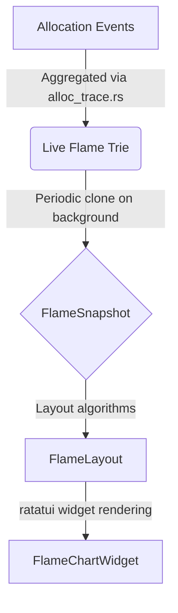

# Flame Chart Architecture

The Flame Chart implementation in m-vis provides an interactive visualization of memory allocation call stacks. This document outlines the data flow pipeline and architectural design to help new contributors understand how it works.

## Pipeline Overview

The pipeline strictly follows a uni-directional flow, transforming live allocation data into an immutable snapshot, processing layout metrics, and finally rendering to the TUI.

### 1. Aggregator (`FlameTrie`)
The Live Aggregator (`src/core/aggregator.rs`) processes raw allocation and free events, building a mutable `FlameNode` trie. To keep memory footprint low and lookups fast, nodes store a `FrameId` instead of a full string symbol. The string mappings are kept in a separate `SymbolTable`.

### 2. Snapshot (`FlameSnapshot`)
To prevent the UI renderer from locking the live profiler or encountering inconsistent states (e.g., node disappears while drawing), we capture an immutable snapshot:
- **`FlameSnapshot`**: A deep clone of the current `FlameNode` trie and `SymbolTable` state. 
- Sent to the UI thread via a non-blocking `mpsc::channel`.

### 3. Layout (`FlameLayout`)
The `FlameLayout` calculates physical `x` and `width` bounds for every node in the tree based on terminal width and the selected `Metric` (Live Bytes, Total Bytes, Peak Live Bytes). 
- Nodes are sized proportionally to their byte contribution to the root.
- Integer division remainders are intelligently handled to avoid clipping/overflows.

### 4. Renderer (`FlameChartWidget`)
The layout vector is rendered to screen using `ratatui`. Color coding is applied according to the user's `ColorMode` preference (e.g., Depth, Bytes, Module). A `FlameNavigator` is consulted to apply visual focus styling to the actively selected node and its subtree.

## Adding Features

- **New Metrics:** Add the enum variant to `Metric` and update the matching logic in `FlameLayout::build`.
- **Keyboard Navigation:** Modify `FlameNavigator::handle_key` to update `selected_node`.
- **Custom Coloring:** Add a new `ColorMode` and implement its visual mapping inside `renderer.rs`.
